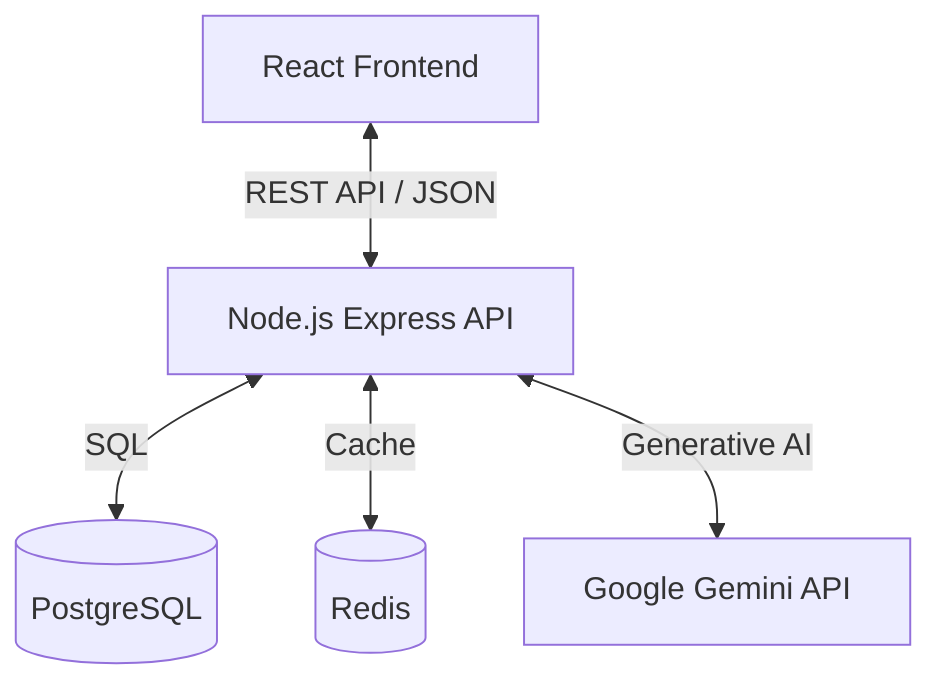

# Architecture

The project follows a standard Monorepo-like structure (though currently in a single repo without workspaces) separating the Client (Frontend) and Server (Backend).

## High-Level Diagram

## Backend (`/server`)
- **Runtime:** Node.js
- **Framework:** Express.js
- **Database Driver:** `pg` (node-postgres)
- **AI Integration:** `@google/generative-ai`
- **Caching:** `redis` (Used for caching Gemini AI responses for 24h to save costs/tokens).
- **Key Files:**
    - `index.js`: Main entry point, contains all routes and logic (Monolithic file pattern - *Candidate for refactoring*).

## Frontend (`/src`)
- **Framework:** React 19 (via Vite)
- **Language:** TypeScript
- **Styling:** Tailwind CSS
- **State Management:** React Context API (`AuthContext`, `GroupContext`).
- **Routing:** React Router DOM.
- **Icons:** Lucide React.

## Deployment / Infrastructure
- **Containerization:** Docker & Docker Compose.
- **Services:**
    - `app`: Frontend (Nginx serving static build).
    - `server`: Node.js backend.
    - `db`: PostgreSQL 13+.
    - `redis`: Redis cache.