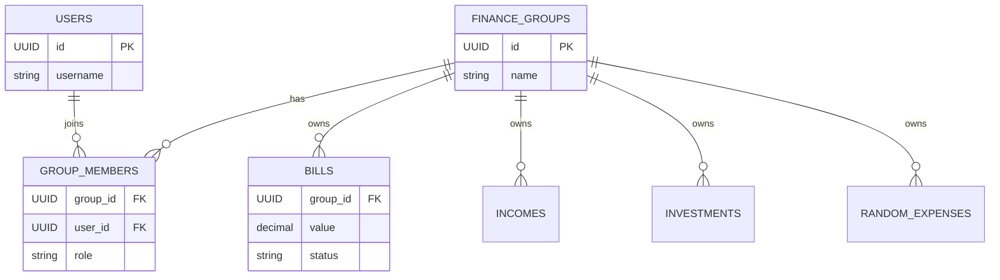

# Database Schema

The application uses a PostgreSQL database. The schema has evolved to support group-based financial management (multi-tenancy where a group is a tenant).

## Tables

### `users`
Stores user authentication information.
- `id` (UUID, PK): Unique identifier.
- `username` (VARCHAR): User's login name.
- `password_hash` (VARCHAR): BCrypt hashed password.
- `created_at` (TIMESTAMP): Creation timestamp.

### `finance_groups`
Represents a shared financial context (e.g., a family or couple).
- `id` (UUID, PK): Unique identifier.
- `name` (VARCHAR): Name of the group.
- `created_at` (TIMESTAMP): Creation timestamp.

### `group_members`
Links users to groups and defines their permissions.
- `id` (UUID, PK): Unique identifier.
- `group_id` (UUID, FK -> `finance_groups`): The group.
- `user_id` (UUID, FK -> `users`): The user.
- `role` (VARCHAR): 'admin', 'editor', or 'viewer'.
- `joined_at` (TIMESTAMP): When the user joined.

### Financial Entities
All financial entities are now linked to a `group_id`. The `user_id` column exists for audit/legacy purposes but ownership is defined by the group.

#### `bills` (Recurring/Scheduled Payments)
- `id` (UUID, PK)
- `group_id` (UUID, FK)
- `user_id` (UUID, FK)
- `name` (VARCHAR): Description of the bill.
- `value` (DECIMAL): Amount.
- `due_date` (DATE): When the bill is due.
- `status` (VARCHAR): 'pending', 'paid', 'overdue'.
- `paid_date` (TIMESTAMP): When it was actually paid.

#### `incomes` (Revenue)
- `id` (UUID, PK)
- `group_id` (UUID, FK)
- `user_id` (UUID, FK)
- `description` (VARCHAR): Source of income.
- `value` (DECIMAL): Amount.
- `date` (DATE): Date of receipt.

#### `investments` (Savings/Assets)
- `id` (UUID, PK)
- `group_id` (UUID, FK)
- `user_id` (UUID, FK)
- `name` (VARCHAR): Name of investment (e.g., "CDB Bank X").
- `initial_amount` (DECIMAL): Starting principal.
- `cdi_percent` (INTEGER): Yield relative to CDI (default 100).
- `start_date` (DATE): Investment start date.
- `duration_months` (INTEGER): Maturity period.

#### `random_expenses` (One-off Spendings)
- `id` (UUID, PK)
- `group_id` (UUID, FK)
- `user_id` (UUID, FK)
- `name` (VARCHAR): Description.
- `value` (DECIMAL): Amount.
- `date` (DATE): Date of expense.
- `status` (VARCHAR): 'pending', 'paid', 'overdue'.

## Entity Relationship Diagram (Mermaid)

